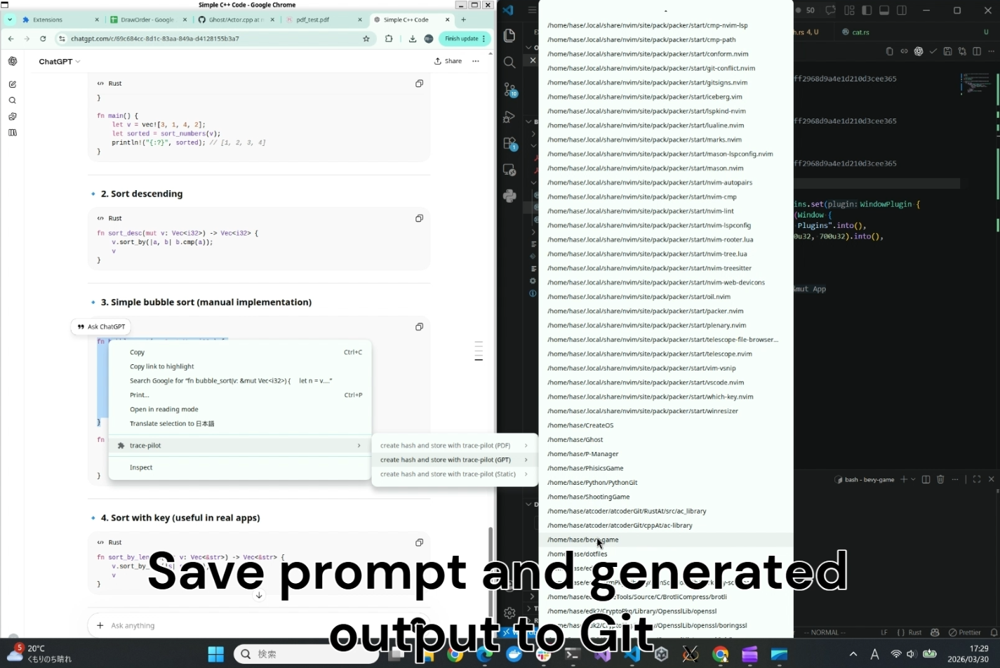
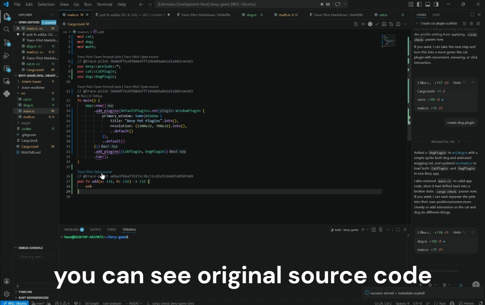
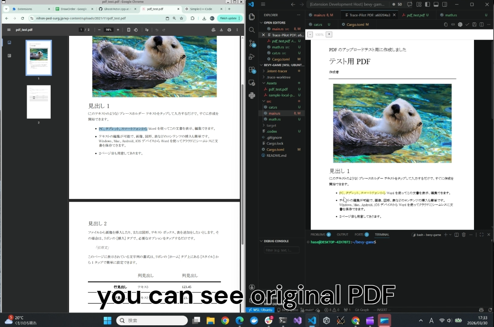
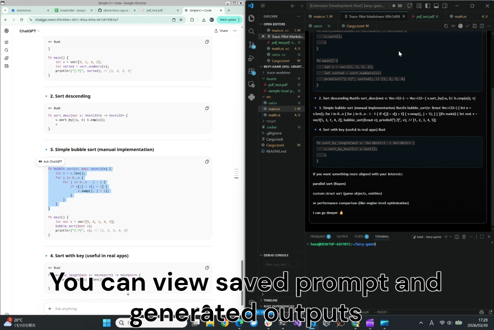
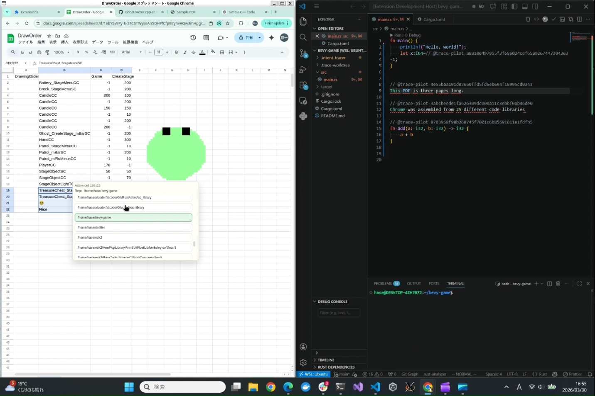
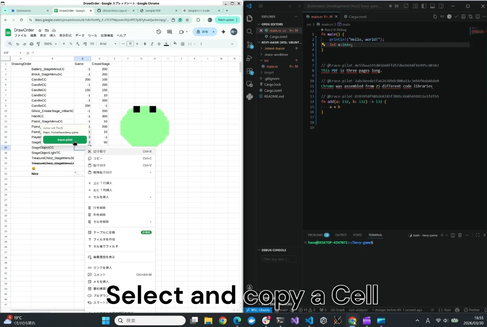
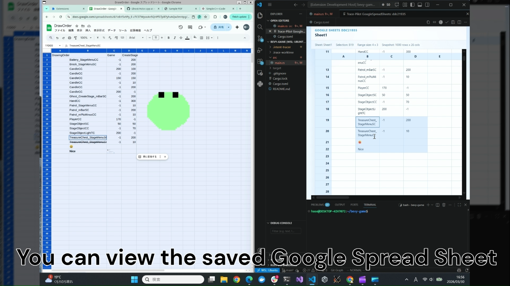
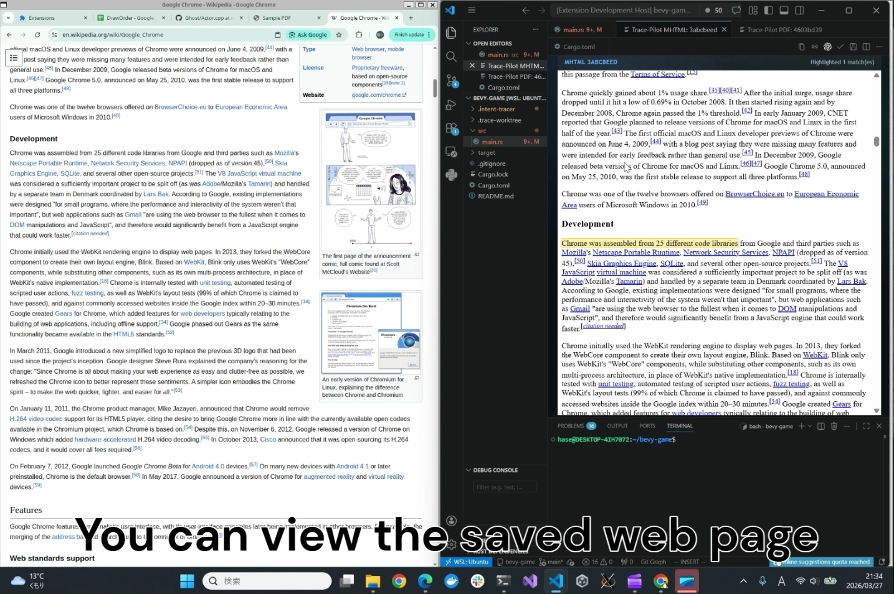

# trace-pilot-chrome

`trace-pilot-chrome` is a Chrome extension that preserves the provenance of copied text.

Trace-Pilot captures the text you copy from Chrome, stores the original source data in a Git-backed repository, and adds a trace marker to the clipboard. When the text is later pasted into VS Code, that marker can be resolved back to the original source so you can inspect where the content came from and recover its surrounding context.

This helps teams keep copied code and text explainable, auditable, and easier to maintain over time.

## Status

trace-pilot-chrome is currently under review in the Chrome Web Store.

## Platform

This tool currently runs on Linux.

## Install Native Host On Linux

The Chrome extension talks to a local native messaging host named `trace_pilot_host_chrome`.

If you publish a release archive such as `trace-pilot-host-linux-x86_64.tar.gz`, the Linux install flow can be:

```bash
wget https://github.com/otinpan/trace-pilot-chrome/releases/latest/download/trace-pilot-host-linux-x86_64.tar.gz
tar xzf trace-pilot-host-linux-x86_64.tar.gz
cd trace-pilot-host-linux-x86_64
chmod +x install.sh
EXTENSION_ID=<your-chrome-extension-id> ./install.sh
```

`install.sh` installs the native host binary into `~/.local/share/trace-pilot-host/` and writes the native messaging manifest to:

```text
~/.config/google-chrome/NativeMessagingHosts/trace_pilot_host_chrome.json
```

The extension ID is required because Chrome native messaging manifests must declare the allowed origin explicitly.

## Related Project

The VS Code side of Trace-Pilot, which resolves pasted markers and displays the original source data, is available here:

https://github.com/otinpan/trace-pilot

## What This Repository Contains

This repository contains the Chrome extension side of Trace-Pilot. Its responsibilities include:

- Detecting supported pages in Chrome
- Capturing selected text or selected cells
- Collecting source data from the current page
- Sending the captured data to the native host for Git storage
- Writing a trace marker back to the clipboard

## Supported Sources

The extension currently supports content copied from:

- ChatGPT
- Google Sheets
- PDF pages opened in Chrome
- Static web pages

## How It Works

1. Open a supported page in Chrome.
2. Select the text or cells you want to preserve.
3. Right-click and choose a Trace-Pilot context menu item.
4. Select the target Git repository.
5. The extension captures the selected content together with its source data.
6. The data is stored through the native host in a Git-backed repository.
7. A trace marker is added to the clipboard along with the copied text.
8. When you paste the result into VS Code, the marker can be used to trace the content back to its origin.




## Why Use It

Copied text and code often lose their source context. Trace-Pilot helps preserve that context by storing:

- Where the text came from
- The original surrounding data
- A stable reference that can be resolved later

It is also more resilient to link rot because the source data is preserved in your own Git repository rather than relying only on external URLs.

This is especially useful for:

- Research workflows
- Note-taking
- AI-assisted writing and coding
- Long-lived software projects

## Usage

Trace-Pilot has not been released yet, but the intended workflow is:

1. Open a supported page in Chrome.
2. Select the text or cells you want to preserve.
3. Right-click and choose a Trace-Pilot menu item.
4. Select the destination Git repository.
5. Paste the result into VS Code and inspect the source later when needed.

## Features by Source

Trace-Pilot supports copying from multiple kinds of web content. After you open the context menu and choose a destination Git repository, the extension stores the source data and places a trace marker on the clipboard. When the content is pasted into VS Code, the marker can be used to recover the original source data.

### PDF

When you open the context menu on a PDF page in Chrome, Trace-Pilot shows PDF-specific menu items.



### ChatGPT

When you open the context menu on a ChatGPT page in Chrome, Trace-Pilot shows ChatGPT-specific menu items. It stores both the prompt and the generated output as source data in Git.



### Google Sheets

When you select cells in Google Sheets and open the context menu, Trace-Pilot shows a dedicated menu item. After you click it, you can choose a Git repository. The selected cell values and the relevant sheet data are then stored as source data.





### Static Web Pages

On pages other than the specialized sources above, Trace-Pilot provides an option for static web pages. It stores the selected text together with relevant page elements as source data in Git.


